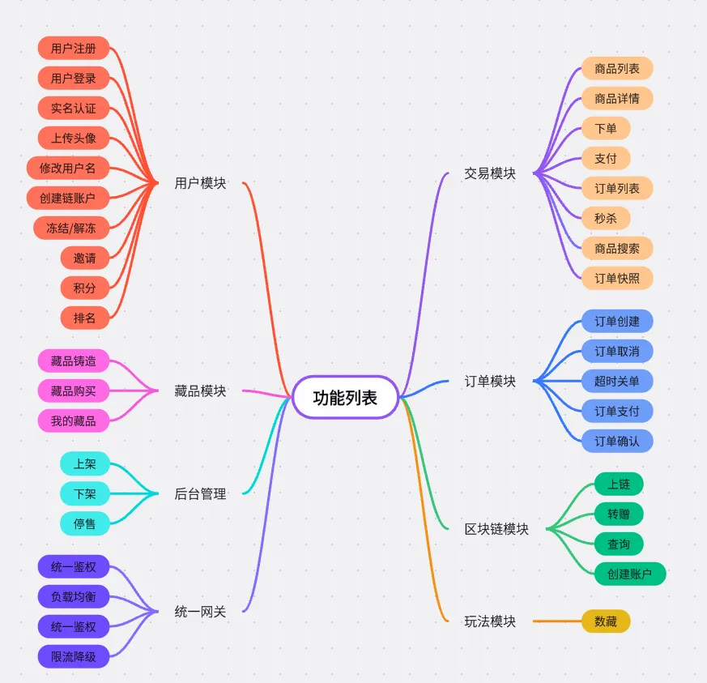
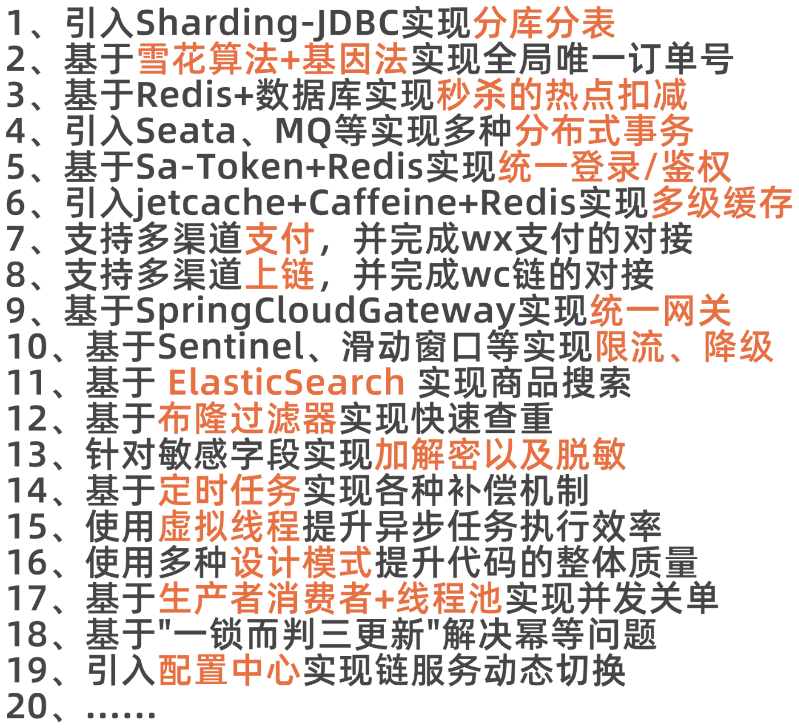
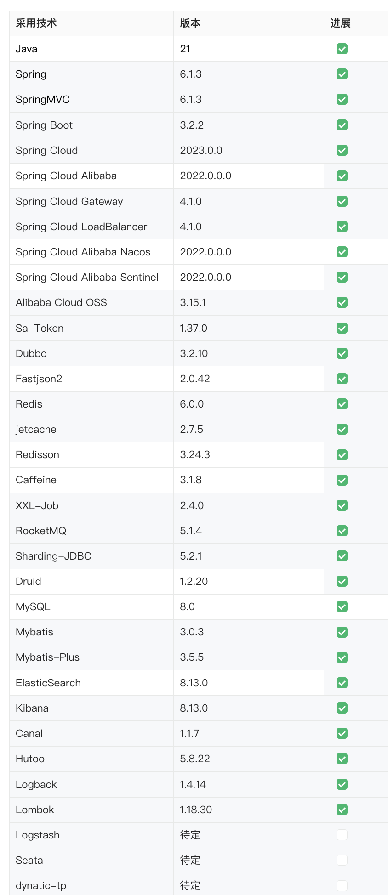
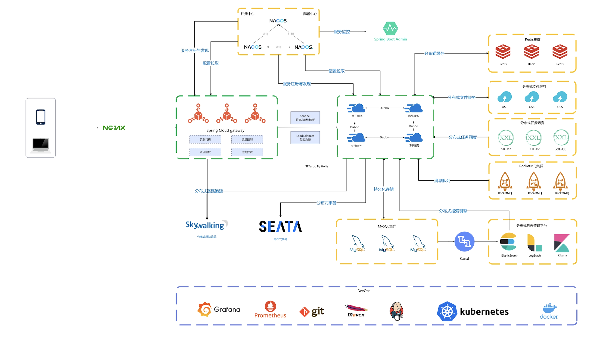
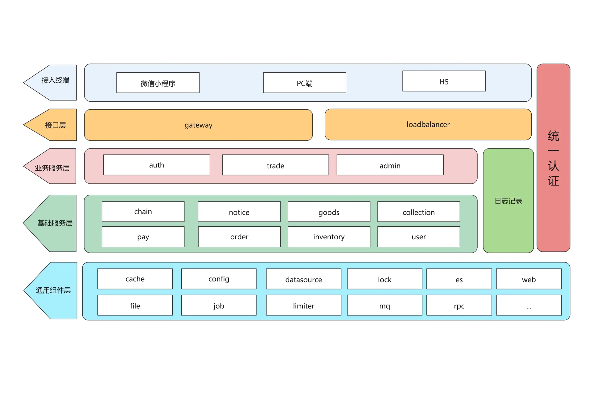

# 声明

！！！本项目非开源项目，禁止发布到任何公开的 git 仓库中，如需自行 git 管理，请发布到私密仓库！一经发现，将立即移除权限，并追究法律责任！

# 常用地址

🔥🔥🔥项目介绍及购买地址：[http://nfturbo.wiki/](http://nfturbo.wiki/)

🔥项目交流群：[https://thoughts.aliyun.com/workspaces/6655879cf459b7001ba42f1b/docs/6673c2f45e11940001c785cc](https://thoughts.aliyun.com/workspaces/6655879cf459b7001ba42f1b/docs/6673c2f45e11940001c785cc)

🔥代码地址：[https://codeup.aliyun.com/66263f57d833774c93cc0418/NFTurbo](https://codeup.aliyun.com/66263f57d833774c93cc0418/NFTurbo)

🔥课程学习地址（视频+文档）：[https://aoybo.xet.tech/s/2prw1D](https://aoybo.xet.tech/s/2prw1D)

🔥学习讨论地址：[https://wx.zsxq.com/dweb2/index/group/88888288882252](https://wx.zsxq.com/dweb2/index/group/88888288882252)

🔥阿里云服务器优惠地址：[https://thoughts.aliyun.com/workspaces/6655879cf459b7001ba42f1b/docs/667054050f232c0001a545fb](https://thoughts.aliyun.com/workspaces/6655879cf459b7001ba42f1b/docs/667054050f232c0001a545fb)

🔥常见问题：[https://thoughts.aliyun.com/workspaces/6655879cf459b7001ba42f1b/folders/6673f1c82d397600011bd921](https://thoughts.aliyun.com/workspaces/6655879cf459b7001ba42f1b/folders/6673f1c82d397600011bd921)

# NFTurbo (拖把数藏)

NFTurbo 项目，是一个数字藏品交易平台。结合传统电商+区块链技术，后期还会结合大模型、AIGC 等。

>数字藏品（Digital Collectibles）是一种基于区块链技术的数字资产，通常以不可替代代币（Non-Fungible Tokens, NFTs）的形式存在。这些藏品可以是各种形式的数字艺术品、音乐、视频、虚拟物品、游戏道具等。每一个数字藏品都是独一无二的，具有唯一的识别信息和所有权记录。这种特性使得数字藏品具有较高的收藏和投资价值。

# 功能列表

目前已经完善了核心链路，如用户注册、登录、认证，商品查看、下单、支付、关闭，以及藏品的购买等功能。后续还有更多的功能规划，包括用户的邀请、积分、排名，藏品的铸造、发行、转赠，后台的管理功能、藏品合成、空投、转赠、预订、抽奖等玩法，以及一些运维相关的监控、压测、对账等功能。

# 适合谁看？

1、有 Java 基础但是没有真实的项目经历

2、有项目经历，但是自己的项目太水没亮点

3、日常工作都是在做 CRUD，没有技术难点

4、希望学习并掌握当今最新的 SpringCloud 技术栈

# 项目亮点

1、`高并发`、`大流量`、`分布式电商+数藏项目`

2、市面上的`主流微服务技术栈`

3、JDK 及各个框架、中间件均采用`新版本`

4、各种新特性、玩法的全方面应用

5、结合`区块链`等`高新技术`

6、整合`跨端技术`实现多端访问

7、`分库分表`、`分布式事务`、`分布式锁`、`秒杀`、`延迟消息`、`高并发`等问题的**可落地解决方案**

# 高性价比

dont say so much，懂的自然懂！

# 项目特点

|  |  |
|--|--|
| 特点 |  理由 |
|**高并发&大流量**|数藏项目是集电商+区块链于一身的项目，因为数藏本身具有收藏和增值的属性，所以天然存在秒杀场景，并且业务量也通常都是比较大的。所以存在高并发、大流量的特性。|
|**微服务**|数藏项目涉及到很多功能模块、比如认证、登录、用户管理、藏品管理、下单、支付、藏品管理、上链等等，天然适合做微服务部署。|
|**技术创新**|数字藏品底层是基于区块链进行管理的，所以在数藏业务中可以用到区块链技术。后期还会结合大模型、AIGC 等技术|
|**项目真实性**|而且市面上并没有形成垄断，有一些大公司在做，比如蚂蚁的鲸探，同时也有很多中小公司也都在研发自己的数藏交易平台。所以，项目的真实性不太容易被质疑。|
|**业务流程简单**|而且数藏电商的业务流程要比纯电商的业务要简单一些，比如不涉及到很复杂的逆向，也不太涉及到营销、结算这些。但是秒杀、支付、库存、搜索等核心功能也都是有的。|
|**跨端技术**|市面上的数藏的产品基本都是小程序或者 h5的，所以非常适合用 uni-app 这种目前比较主流的跨端技术。|
|**个性玩法**|在电商之外，还有很多独特的玩法，比如空投、合成、盲盒、转赠等。所以，因为他有高并发场景、有技术创新、业务逻辑简单、有独特玩法，所以非常适合我们作为项目学习，并且项目真实性有保障！|

# 技术栈

### 后端技术

目前该项目才用的是市面上最主流的分布式技术栈，即 SpringCloud Alibaba + Nacos + Dubbo + RocketMQ + xxl-job + Redis + MySQL，具体的依赖技术以及对应版本见下表：

### 前端技术

Vue、uniapp、JavaScript

### 开发工具

IDEA、HBuilderX、Shell、 ApiFox、Chrome、Git、Maven

# 项目架构

### 系统架构

### 业务架构

